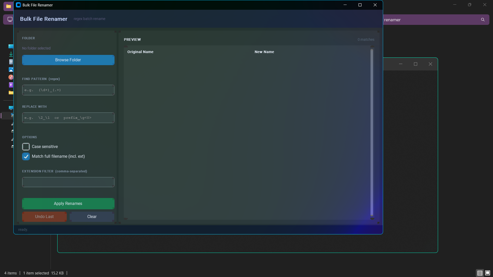

# Bulk File Renamer

[](https://python.org)
[](https://github.com/WShehab/Bulk-File-Rename)
[](LICENSE)
[](https://github.com/WShehab/Bulk-File-Rename/stargazers)

A desktop utility for batch-renaming files using regex patterns. Built with Python and CustomTkinter.



---

## Features

- Live preview before anything gets renamed
- Full regex support — capture groups, backreferences, flags
- Match against full filename or stem only
- Extension filter to target specific file types
- Conflict detection — aborts if the pattern produces duplicates
- Undo support — reverts the last batch rename
- Handles large directories without slowing down

---

## Usage

```bash
git clone https://github.com/WShehab/Bulk-File-Rename
cd Bulk-File-Rename
python bulk_renamer.py
```

`customtkinter` installs automatically on first run if it's not already there.

---

## Regex Examples

| Pattern | Replace | Effect |
|---|---|---|
| `(\d+)_(.+)` | `\2_\1` | swaps number and name |
| `^` | `prefix_` | adds prefix to every file |
| `\s+` | `_` | replaces spaces with underscores |
| `(?i)\.jpeg$` | `.jpg` | normalizes extension |
| `ep(\d)` | `ep0\1` | zero-pads single-digit episode numbers |

---

## Requirements

- Python 3.10+
- customtkinter (auto-installed)

---

## License

[MIT](LICENSE)
